<!-- markdownlint-disable MD033 -->
<!-- markdownlint-disable MD041 -->

  

<!--
看这里 👋
我是 ooseven-zh2013
一个喜欢coding的初中牲
欢迎来到我的Github Profile
 -->

  

<!--
Hi there 👋
I'm ooseven-zh2013
A middle school student who loves coding
Welcome to my GitHub profile
 -->

## 🔭 我正在做什么

> What am I currently working on?

目前我正在开发的是 **[Game](https://github.com/ooseven-zh2013/Game)** 和 **[MathsLearning](https://github.com/ooseven-zh2013/MathsLearning)** 项目。

> I'm currently working on the projects called **[Game](https://github.com/ooseven-zh2013/Game)** and **[MathsLearning](https://github.com/ooseven-zh2013/MathsLearning)**.

## 🌱 我正在学什么

> What am I currently learning?

全栈开发，目前在学基础的HTML。

> Full stack development, currently learning basic HTML.

## 📫 如何联系我

> How to reach me?

邮箱：[ooseven_zh2013@163.com](mailto:ooseven_zh2013@163.com)（主要的）或[ooseven_zh2013_@outlook.com](mailto:ooseven_zh2013_@outlook.com)。

> Email: [ooseven_zh2013@163.com](mailto:ooseven_zh2013@163.com) (main) or [ooseven_zh2013_@outlook.com](mailto:ooseven_zh2013_@outlook.com)

QQ号：3808989166。

> QQ number: 3808989166.

## 😄 如何称呼我

> Pronouns

他/他

> he/him

## ⚡ 有趣的事实

> Fun fact

我的项目中超过一半的`readme.md`都是AI写的。（这个不是）

> More than half of the `readme.md` files in my projects are written by AI. (Not this one)

---

## 📊 GitHub 统计

> GitHub Stats

<!-- 主要统计 -->

  

<!-- 贡献日历 -->

  

<!-- 语言统计 -->

  

